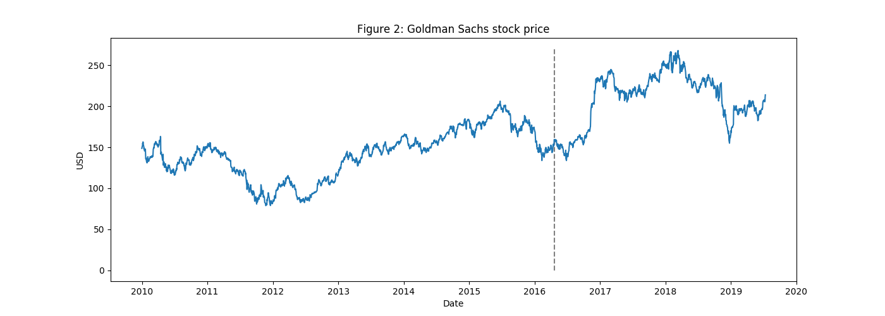

# Yahoo

## About
This repo aims to get an access to Yahoo Finance Data 

### Dependencies 

This repo currently relies on `yfinance` which is the most recent active fin data retrieving API.

    pip install yfinance --upgrade --no-cache-dir

### Goldman Sachs NYSE

__[Boris](https://github.com/borisbanushev/stockpredictionai)__ has utilized `NYSE/GS` data to introduce his approach.
This repository provides the data he has used by getting access to the yahoo finance data. 

- `data/get_nyse_gs.py` is the code to retrieve the `NYSE/GS` data and pickle the data with the name `data/nyse_gs.pkl`

- `data/plot_nyse_gs.py` is the code to reproduce the following plot that __[boris](https://github.com/borisbanushev/stockpredictionai)__ has introduced in his repo with the data stored in `nyse_gs.pkl`.

  

